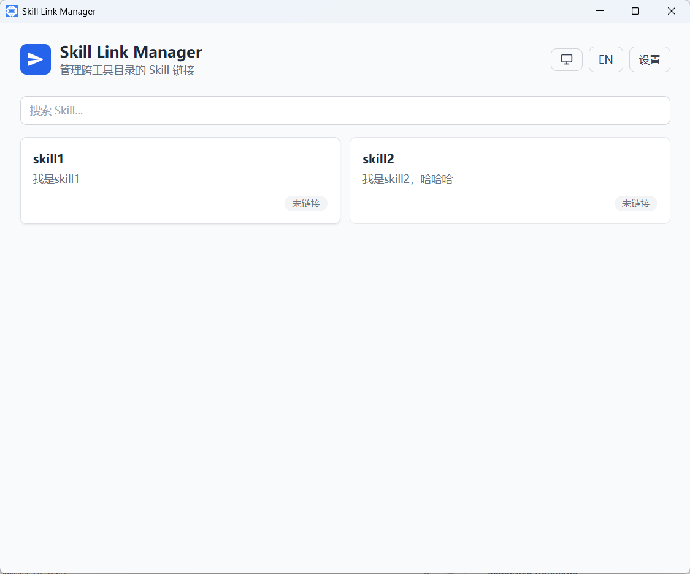
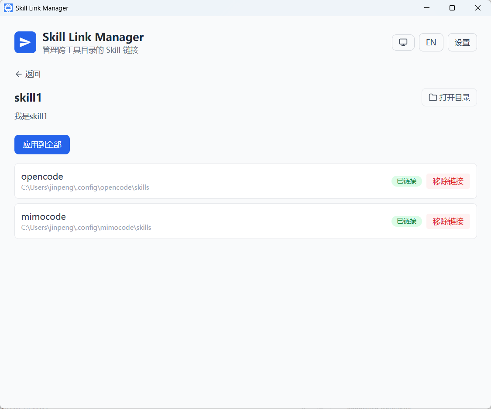
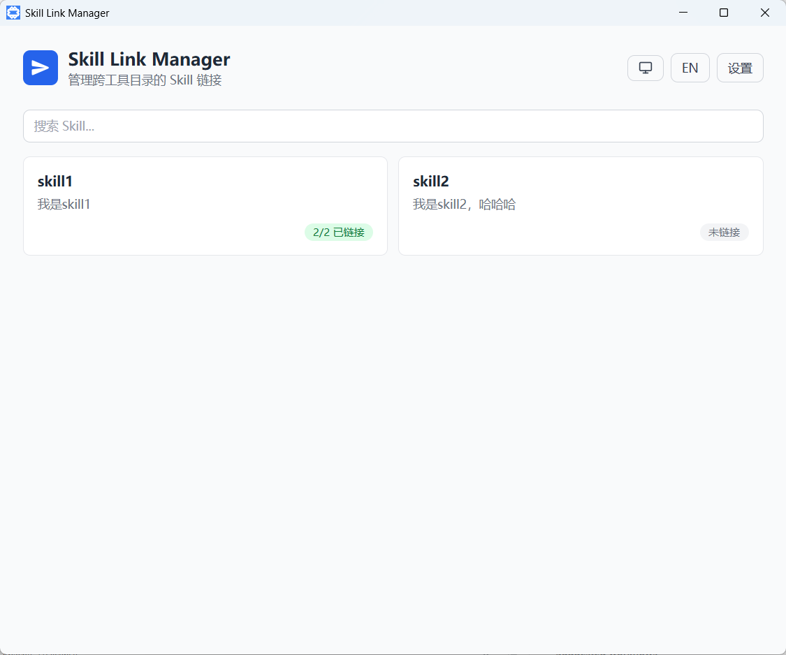
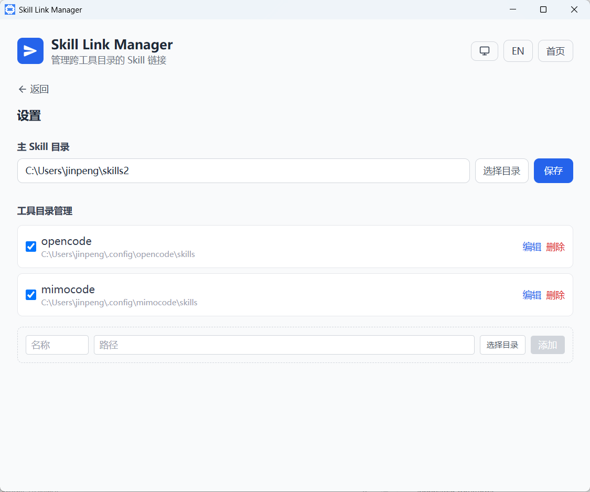
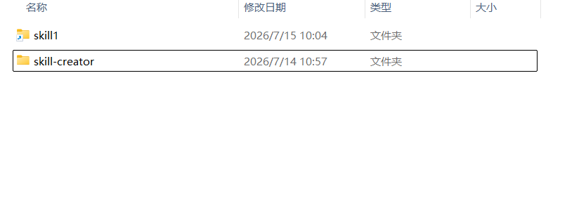

<p align="center">
  
</p>

<h1 align="center">Skill Link Manager</h1>

<p align="center">
  <b>编辑一次技能，在所有 AI 编码工具中即时可用 —— 用链接代替复制。</b>
</p>

<p align="center">
  <a href="#安装"></a>
  <a href="https://tauri.app"></a>
  <a href="https://react.dev"></a>
  <a href="LICENSE"></a>
</p>

> 一个基于 [Tauri 2](https://tauri.app/) 的跨平台桌面应用，用来在多个 AI 编码工具之间同步「技能」（AI 智能体的指令文件夹）。在共享目录里编辑一次，技能就会以链接的形式出现在所有已支持的 AI 工具中——无需逐个复制粘贴。

## 目录

- [预览](#预览)
- [功能特性](#功能特性)
- [核心思路](#核心思路)
- [支持的工具](#支持的工具)
- [技术栈](#技术栈)
- [项目结构](#项目结构)
- [环境要求](#环境要求)
- [安装](#安装)
- [快速开始](#快速开始)
- [配置说明](#配置说明)
- [适用场景与限制](#适用场景与限制)
- [贡献](#贡献)
- [许可证](#许可证)

## 预览

| 序号 | 画面 | 说明 |
| --- | --- | --- |
| 1 |  | 首次启动后的主页，技能尚未建立任何链接 |
| 2 |  | 单个技能（skill1）的详情页，可逐工具目录管理链接开关 |
| 3 |  | 为 skill1 建立链接后，主页卡片显示其已链接状态 |
| 4 |  | 目录配置页，可修改共享目录、增删与勾选工具目录 |
| 5 |  | Windows 下 opencode 的技能目录，可见 skill1 以链接形式存在 |

## 功能特性

- **一处维护，处处生效**：在共享技能目录中编辑技能，所有工具通过链接即时可见，无需逐个复制。
- **多工具支持**：内置 18+ 常见 AI 编码工具（opencode、codebuddy、claude、cursor、comate、windsurf、gemini 等），首次启动自动检测已安装的工具。
- **可视化操作**：主页卡片展示每个技能的链接状态；详情页可针对单个工具目录单独开启/关闭链接。
- **跨平台链接**：Windows 使用目录联接（junction，免管理员/开发者模式），macOS 与 Linux 使用符号链接（symlink）。
- **首次引导**：首次运行提供引导流程，自动探测本机已安装的工具并生成默认配置。

## 核心思路

- 存在一个**共享技能目录**（默认 `~/skills`），每个子文件夹就是一个技能。
- 每个 AI 工具（opencode、codebuddy、claude、cursor 等）都会在自身的配置目录下存放自己的技能。
- 本应用在各个工具的 `skills/<名称>` 目录中创建一个**链接**，指向共享目录里的 `skills/<名称>` 文件夹。

链接类型在编译时按平台自动选择：

| 平台 | 链接方式 | 备注 |
| --- | --- | --- |
| Windows | 目录联接（junction） | 无需管理员权限或开发者模式 |
| macOS / Linux | 符号链接（symlink） | 系统原生软链接 |

> 链接而非复制：技能在共享目录中只存一份，所有工具读到的都是同一份内容。改一处，处处更新；删一处，处处失效（详见 [适用场景与限制](#适用场景与限制)）。

## 支持的工具

下列工具路径已内置在 [`src-tauri/src/known_agents.json`](src-tauri/src/known_agents.json)，首次启动时会自动探测本机已安装的部分：

| 工具 | 技能目录（相对用户主目录） |
| --- | --- |
| opencode | `.config/opencode/skills` |
| mimocode | `.config/mimocode/skills` |
| codebuddy | `.codebuddy/skills` |
| comate | `.comate/skills` |
| trae-cn | `.trae-cn/skills` |
| workbuddy | `.workbuddy/skills` |
| qclaw | `.qclaw/skills` |
| codex | `.codex/skills` |
| claude | `.claude/skills` |
| cline | `.cline/skills` |
| roo | `.roo/skills` |
| continue | `.continue/skills` |
| gemini | `.gemini/skills` |
| cursor | `.cursor/skills` |
| windsurf | `.codeium/windsurf/skills` |
| augment | `.augment/skills` |
| copilot | `.copilot/skills` |
| kiro | `.kiro/skills` |

> 新增一个默认工具路径，只需在 `known_agents.json` 里加一行 `{ "name": "...", "path": "..." }`，无需改动 Rust 代码。

## 技术栈

- **前端：** React 18 + TypeScript + Vite，使用 Tailwind CSS 美化样式
- **后端：** 基于 Tauri 2 的 Rust
- **打包：** Tauri `bundle.targets: "all"`（Windows 生成 msi / nsis，macOS 生成 dmg / app，Linux 生成 deb / AppImage）

前端与后端仅通过 Tauri 的 IPC（`invoke`）通信，二者之间没有共享的接口定义文件——新增或修改命令时，需手动保持 `lib.rs` 中的命令名与 `src/types.ts` 同步。

## 项目结构

```
skill-link-manager/
├── src/                 # React + TypeScript 前端
│   ├── App.tsx          # 顶层页面与状态机
│   ├── components/      # SkillCard、SkillDetail、SettingsPage、ToolDirDetail、Onboarding
│   ├── i18n/            # 中文 / 英文翻译
│   ├── types.ts         # Rust 结构体的 TypeScript 镜像
│   └── main.tsx         # 入口文件
├── src-tauri/           # Rust 后端 + Tauri 配置
│   ├── src/lib.rs       # 全部后端逻辑与 Tauri 命令
│   ├── src/known_agents.json  # 内置的已知工具技能目录清单（默认路径）
│   ├── Cargo.toml
│   └── tauri.conf.json
├── img/                 # 文档用截图
├── index.html
├── vite.config.ts
├── tailwind.config.js
└── package.json
```

## 环境要求

- [Node.js](https://nodejs.org/)（用于前端工具链）
- [Rust](https://www.rust-lang.org/tools/install)（稳定版，并安装对应平台的目标）
- Tauri 2 的平台构建依赖（参见 [Tauri 环境准备指南](https://tauri.app/start/prerequisites/)）

## 安装

**从源码构建**（推荐给开发者）：

```bash
# 1. 安装前端依赖
npm install

# 2. 构建并启动桌面应用（开发模式，含热更新）
npm run tauri dev

# 3. 打包为安装程序 / 应用（输出到 src-tauri/target/release/bundle/）
npm run tauri build
```

**从发布版安装**：前往 [GitHub Releases](https://github.com/owner/repo/releases) 下载对应平台的安装包（Windows 为 `.msi` / `.exe`，macOS 为 `.dmg`，Linux 为 `.deb` / `.AppImage`）。

## 快速开始

```bash
# 安装前端依赖
npm install

# 运行完整桌面应用（Vite 开发服务器监听 :5173 + Tauri 窗口）
npm run tauri dev

# 仅进行类型检查并构建前端
npm run build

# 构建打包后的安装程序 / 应用
npm run tauri build

# 仅预览已构建的前端
npm run preview
```

> 类型安全是本项目的唯一校验关卡，由 `tsc` 负责（`npm run build` 执行 `tsc && vite build`）。本项目未配置测试套件或代码检查工具。

典型使用流程：

1. **首次启动** → 引导页自动检测已安装的工具，生成默认配置（共享目录 `~/skills`）。
2. **放入技能** → 在 `~/skills` 下新建一个文件夹（如 `my-skill/`），写入该工具的技能文件。
3. **建立链接** → 在应用主页点击该技能，选择要链接到的工具目录，链接即时生效。
4. **随处可用** → 打开对应 AI 工具，技能已自动出现，无需任何额外配置。

## 配置说明

配置保存在 `<配置目录>/skill-link-manager/config.json`：

- Windows：`%APPDATA%`
- macOS：`~/Library/Application Support`
- Linux：`~/.config`

删除该文件即可将应用重置为首次启动的引导流程。默认的 `shared_dir` 为 `~/skills`。

## 适用场景与限制

为帮助你判断本工具是否合适，这里坦诚说明它的边界：

- **只管理「技能的链接」，不管理工具自身的配置**。每个 AI 工具仍需各自正常安装；本应用只负责把共享技能挂接到它们的技能目录。
- **链接指向共享目录**，因此共享目录不可随意删除或移动，否则所有链接会失效。
- **删除/修改共享目录中的技能，会同时影响所有已链接的工具**——这是链接的固有特性，也是「一处维护、处处生效」的另一面。
- **实际可用性取决于各工具是否真正读取其 `skills/` 目录**。绝大多数兼容 Claude 技能格式的工具都支持，但个别工具可能有自己的加载逻辑。
- **目前无后台自动同步**：链接的建立/更新需在应用内手动点击「应用链接」，或运行下面的独立脚本。

## 独立脚本

这些脚本早于本应用存在，用于在特定场景下复现其部分逻辑：

- `link-skills.ps1` + `run.bat` —— 在应用之外，用 PowerShell 复现 `apply_links` 的逻辑。
- `generate-icon.cjs` —— 生成 `src-tauri/icons/source.png`；执行 `npx tauri icon src-tauri/icons/source.png` 可重新生成所有平台的图标。

## 贡献

欢迎提交 Issue 与 Pull Request！

- 报告问题或建议功能：请使用 [GitHub Issues](https://github.com/owner/repo/issues)。
- 代码贡献：fork 后发起 PR，确保 `npm run build` 通过类型检查即可。
- 新增默认工具路径：只需编辑 [`src-tauri/src/known_agents.json`](src-tauri/src/known_agents.json)，无需改动 Rust 代码。

## 许可证

本项目基于 [Apache License 2.0](LICENSE) 开源。
